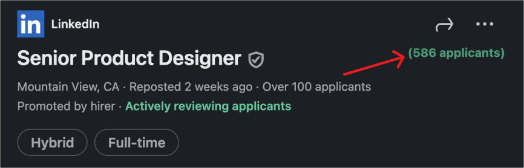

# LinkedIn Exact Applicant Count

**Tired of "Over 100 people clicked apply" without knowing the precise number?**

This Chrome Extension solves that problem.
The **LinkedIn Exact Applicant Count** reveals the true number of applicants for any job directly on LinkedIn.

(Currently under review my Chrome team, will paste my link to extension here)

---

## Install from GitHub (For Advanced Users)

This method lets you install the extension directly from the code.

1.  Click the green **"Code"** button above.
2.  Select **"Download ZIP"**.
3.  **Unpack** the downloaded ZIP file. Rename the unzipped folder to something simple (e.g., `linkedin-applicants`).
4.  Open your Chrome (or Chromium-based) browser and go to `chrome://extensions`.
5.  Toggle **"Developer mode"** ON (top right).
6.  Click **"Load unpacked"**.
7.  Select the **unzipped folder** you just named.
8.  **Pin** the extension icon to your browser's toolbar for easy access.
9.  **Reload** any open LinkedIn tabs or open LinkedIn in a new tab.
10. **Browse any job posting:** You'll see the exact number of applicants displayed next to the job title on the details panel.

---

## Don't Want the Extension? (Manual Method)

**Reminder:** This is more technical and only shows the count for one job post at a time.

You can still find the number using your browser's developer tools:

1.  On a LinkedIn job post (ideally one showing "Over 100 applicants"), **right-click anywhere** on the page.
2.  Select **"Inspect"** from the context menu.
3.  Go to the **"Network"** tab.
4.  In the filter box, type `voyager/api/jobs`.
5.  Reload the Linkedin page you inspected
6.  Look for a request starting with a job ID (e.g., `427...`). Click on it.
7.  In the right-side panel, select the **"Preview"** tab.
8.  Under `'data'`, click to expand the inner `'data'` toggle.
9.  Scroll down to find the **"applies"** field. This is your exact applicant count!

Tutorial: https://www.tiktok.com/@jerryjhlee/video/7533631997990800654
